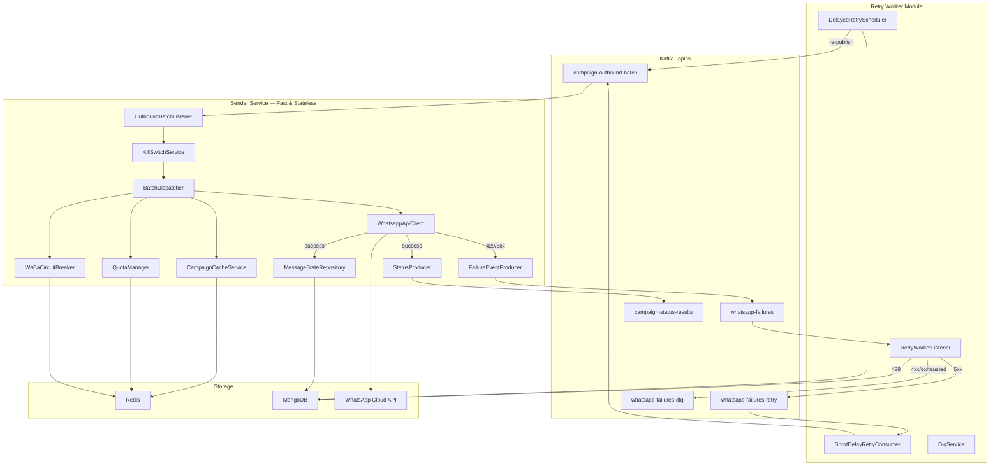

# WhatsApp Enterprise Messaging Architecture — Complete Walkthrough

## Final Project Structure

```
src/main/java/com/whatsapp/sender/
├── MetaWhatsappCloudSenderApplication.java     ← @EnableScheduling added
├── config/
│   ├── HttpClientConfig.java                   ← UNCHANGED
│   ├── JacksonConfig.java                      ← UNCHANGED
│   └── RedisConfig.java                        ← MODIFIED (Lua script beans)
├── controller/
│   └── HealthController.java                   ← UNCHANGED
├── dto/
│   ├── CampaignDetail.java                     ← REWRITTEN (record + tokens map)
│   ├── FailureEvent.java                       ← NEW
│   ├── MessageDispatchDocument.java            ← NEW (MongoDB document)
│   ├── MessageStatusResultEvent.java           ← REWRITTEN (per-target fields)
│   ├── OutboundBatchEvent.java                 ← REWRITTEN (enriched payload)
│   ├── QuotaCheckResult.java                   ← NEW
│   └── WhatsappApiResponse.java                ← UNCHANGED
├── listener/
│   └── OutboundBatchListener.java              ← MODIFIED (new DTO refs)
├── retry/                                      ← NEW MODULE
│   ├── DelayedRetryDocument.java               ← MongoDB doc for 24h retries
│   ├── DelayedRetryRepository.java             ← Spring Data repository
│   ├── DelayedRetryScheduler.java              ← @Scheduled job
│   ├── DlqService.java                         ← Dead Letter Queue handler
│   ├── RetryWorkerListener.java                ← Failures topic consumer
│   └── ShortDelayRetryConsumer.java            ← Retry topic consumer
├── service/
│   ├── BatchDispatcher.java                    ← REWRITTEN (quota + failures)
│   ├── CampaignCacheService.java               ← NEW (Redis caching layer)
│   ├── CampaignServiceClient.java              ← UNCHANGED (upstream HTTP)
│   ├── FailureEventProducer.java               ← NEW (replaces RetryRouter)
│   ├── KillSwitchService.java                  ← UNCHANGED
│   ├── MessageStateRepository.java             ← NEW (async MongoDB writes)
│   ├── QuotaManager.java                       ← NEW (Redis Lua scripts)
│   ├── RetryRouter.java                        ← DEPRECATED (cleared)
│   ├── StatusProducer.java                     ← FIXED (topic property)
│   ├── TokenProvider.java                      ← DEPRECATED (cleared)
│   ├── WaBaCircuitBreaker.java                 ← FIXED (missing constant)
│   └── WhatsappApiClient.java                  ← UNCHANGED
└── resources/
    ├── application.yml                          ← REWRITTEN
    └── scripts/
        ├── quota_check_and_increment.lua        ← NEW
        └── success_counter_increment.lua        ← NEW
```

---

## Architecture Flow Diagram



---

## Component Details

### 1. Batch Ingestion & Context Enrichment

**Files changed:**
- [OutboundBatchEvent.java](file:///c:/projects/meta-whatsapp-cloud-sender/src/main/java/com/whatsapp/sender/dto/OutboundBatchEvent.java) — Enriched with `tenantId`, `whatsappAccountId`, `TemplateInfo`, `Target` inner records
- [CampaignCacheService.java](file:///c:/projects/meta-whatsapp-cloud-sender/src/main/java/com/whatsapp/sender/service/CampaignCacheService.java) — **NEW**: Redis read-through cache wrapping `CampaignServiceClient`

**Key decisions:**
- Cache TTL is configurable via `app.quota.cache-ttl-minutes` (default 10 min)
- Fail-open: Redis errors fall back to upstream HTTP calls
- Both campaign details AND access tokens are cached independently

### 2. Parallel Execution via Virtual Threads

**No changes needed** — `HttpClientConfig` already provides `Executors.newVirtualThreadPerTaskExecutor()` and the `BatchDispatcher` uses `CompletableFuture.supplyAsync()` with it.

### 3. Distributed Quota Management (Redis)

**Files changed:**
- [QuotaManager.java](file:///c:/projects/meta-whatsapp-cloud-sender/src/main/java/com/whatsapp/sender/service/QuotaManager.java) — **NEW**: Atomic Redis quota check/increment with Lua scripts
- [quota_check_and_increment.lua](file:///c:/projects/meta-whatsapp-cloud-sender/src/main/resources/scripts/quota_check_and_increment.lua) — **NEW**: Atomic check-and-increment
- [success_counter_increment.lua](file:///c:/projects/meta-whatsapp-cloud-sender/src/main/resources/scripts/success_counter_increment.lua) — **NEW**: Success counter with auto-TTL
- [RedisConfig.java](file:///c:/projects/meta-whatsapp-cloud-sender/src/main/java/com/whatsapp/sender/config/RedisConfig.java) — Added `DefaultRedisScript` beans

**Redis key patterns:**
| Key | Purpose | TTL |
|-----|---------|-----|
| `quota:waba:{id}:daily:{date}` | Daily WaBa sending counter | 86400s |
| `quota:template:{name}:daily:{date}` | Daily template usage counter | 86400s |
| `campaign:{id}:waba:{number}:success` | Success counter | 86400s |
| `campaign:{id}:detail` | Cached campaign details | configurable |
| `waba:token:{id}` | Cached access token | configurable |

**Rotation strategy:** If primary WaBa exhausted → iterate through `campaignDetail.waBaDetails()` → if ALL exhausted → publish failure event

### 4. Database State Management (MongoDB)

**Files changed:**
- [MessageDispatchDocument.java](file:///c:/projects/meta-whatsapp-cloud-sender/src/main/java/com/whatsapp/sender/dto/MessageDispatchDocument.java) — **NEW**: MongoDB document for `message_dispatch_log`
- [MessageStateRepository.java](file:///c:/projects/meta-whatsapp-cloud-sender/src/main/java/com/whatsapp/sender/service/MessageStateRepository.java) — **NEW**: Async writes on virtual threads

**Collection:** `message_dispatch_log`
**Indexes:** Compound on `(campaign_id, batch_id)`, single on `target_phone_number`

### 5. Failure Event Pipeline (Strict Separation)

**Files changed:**
- [FailureEvent.java](file:///c:/projects/meta-whatsapp-cloud-sender/src/main/java/com/whatsapp/sender/dto/FailureEvent.java) — **NEW**: Structured failure payload
- [FailureEventProducer.java](file:///c:/projects/meta-whatsapp-cloud-sender/src/main/java/com/whatsapp/sender/service/FailureEventProducer.java) — **NEW**: Replaces `RetryRouter`
- [BatchDispatcher.java](file:///c:/projects/meta-whatsapp-cloud-sender/src/main/java/com/whatsapp/sender/service/BatchDispatcher.java) — **REWRITTEN**: Now publishes failures instead of managing retries

**Key principle:** The Sender Service ONLY publishes failure events. It never manages retry delays or rebuilds failed batches.

### 6. Retry Worker Module

**New package:** `com.whatsapp.sender.retry`

| Class | Role |
|-------|------|
| [RetryWorkerListener](file:///c:/projects/meta-whatsapp-cloud-sender/src/main/java/com/whatsapp/sender/retry/RetryWorkerListener.java) | Routes failures by error code: 5xx→retry, 429→MongoDB, 4xx→DLQ |
| [ShortDelayRetryConsumer](file:///c:/projects/meta-whatsapp-cloud-sender/src/main/java/com/whatsapp/sender/retry/ShortDelayRetryConsumer.java) | Reconstructs batches from retry topic → main ingestion topic |
| [DelayedRetryScheduler](file:///c:/projects/meta-whatsapp-cloud-sender/src/main/java/com/whatsapp/sender/retry/DelayedRetryScheduler.java) | `@Scheduled` job polling MongoDB for matured 24h retries |
| [DelayedRetryDocument](file:///c:/projects/meta-whatsapp-cloud-sender/src/main/java/com/whatsapp/sender/retry/DelayedRetryDocument.java) | MongoDB document for `delayed_retries` collection |
| [DelayedRetryRepository](file:///c:/projects/meta-whatsapp-cloud-sender/src/main/java/com/whatsapp/sender/retry/DelayedRetryRepository.java) | Spring Data repository for delayed retries |
| [DlqService](file:///c:/projects/meta-whatsapp-cloud-sender/src/main/java/com/whatsapp/sender/retry/DlqService.java) | Terminal DLQ handler |

**Error routing logic:**
```
429 / CIRCUIT_OPEN → MongoDB delayed_retries (24h backoff)
5xx              → whatsapp-failures-retry (1-5 min backoff)
4xx / other      → whatsapp-failures-dlq (terminal)
max retries hit  → whatsapp-failures-dlq (terminal)
```

---

## Kafka Topics

| Topic | Producer | Consumer | Purpose |
|-------|----------|----------|---------|
| `campaign-outbound-batch` | Upstream service | `OutboundBatchListener` | Main ingestion |
| `campaign-status-results` | `StatusProducer` | Downstream service | Per-target dispatch results |
| `whatsapp-failures` | `FailureEventProducer` | `RetryWorkerListener` | Failed targets routing |
| `whatsapp-failures-retry` | `RetryWorkerListener` | `ShortDelayRetryConsumer` | Short-delay retries |
| `whatsapp-failures-dlq` | `RetryWorkerListener` / `DlqService` | Monitoring service | Terminal failures |

---

## Configuration Changes

render_diffs(file:///c:/projects/meta-whatsapp-cloud-sender/build.gradle)

render_diffs(file:///c:/projects/meta-whatsapp-cloud-sender/src/main/resources/application.yml)

---

## Bug Fixes Applied

1. **WaBaCircuitBreaker**: Added missing `RATE_LIMIT_PREFIX` constant; fixed `isCircuitOpen()` to use `hasKey()` instead of `get()` which returned `String` not `boolean`
2. **StatusProducer**: Fixed `@Value("${app.kafka.topics}")` → `@Value("${app.kafka.topics.campaign-status-results}")`
3. **BatchDispatcher**: Fixed method signature mismatch where `createStatusEvent` was called with wrong parameters and referenced non-existent fields

> [!TIP]
> **Next Steps:** Consider extracting the `retry` package into a separate Spring Boot module with its own `build.gradle` and deployment pipeline. This allows independent scaling of the retry worker based on failure volume without affecting sender throughput.
