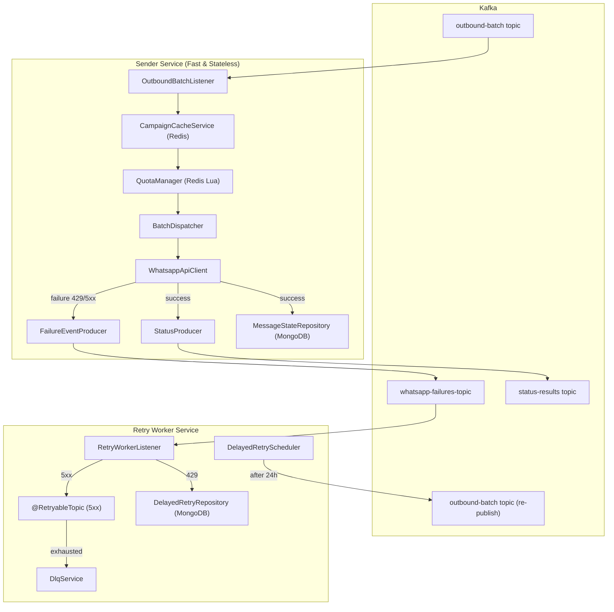

# WhatsApp Enterprise Messaging Architecture — Implementation Plan

## Executive Summary

Refactor the existing `meta-whatsapp-cloud-sender` from a simple batch sender into a **high-throughput, fault-tolerant enterprise messaging architecture** with distributed quota management, MongoDB persistence, and a separate retry worker module.

---

## Current State Analysis

### Existing Files & Status

| File | Action | Notes |
|------|--------|-------|
| [OutboundBatchEvent.java](file:///c:/projects/meta-whatsapp-cloud-sender/src/main/java/com/whatsapp/sender/dto/OutboundBatchEvent.java) | **REPLACE** | Missing `tenantId`, `whatsappAccountId`, `template`, `Target` inner record. Only has `campaignId`, `batchId`, `targetPhoneNumbers` |
| [CampaignDetail.java](file:///c:/projects/meta-whatsapp-cloud-sender/src/main/java/com/whatsapp/sender/dto/CampaignDetail.java) | **REPLACE** | Convert from Lombok class to record; add `accessToken`, `quotas` fields |
| [MessageStatusResultEvent.java](file:///c:/projects/meta-whatsapp-cloud-sender/src/main/java/com/whatsapp/sender/dto/MessageStatusResultEvent.java) | **REPLACE** | Add per-target fields (`recipientId`, `phoneNumber`, `eventId`, `whatsappMessageId`, `errorCode`, `timestamp`) |
| [WhatsappApiResponse.java](file:///c:/projects/meta-whatsapp-cloud-sender/src/main/java/com/whatsapp/sender/dto/WhatsappApiResponse.java) | **KEEP** | Already well-structured |
| [OutboundBatchListener.java](file:///c:/projects/meta-whatsapp-cloud-sender/src/main/java/com/whatsapp/sender/listener/OutboundBatchListener.java) | **MODIFY** | Wire new `CampaignCacheService` instead of direct `CampaignServiceClient` |
| [BatchDispatcher.java](file:///c:/projects/meta-whatsapp-cloud-sender/src/main/java/com/whatsapp/sender/service/BatchDispatcher.java) | **REWRITE** | Add quota checks, WaBa rotation, failure event publishing |
| [CampaignServiceClient.java](file:///c:/projects/meta-whatsapp-cloud-sender/src/main/java/com/whatsapp/sender/service/CampaignServiceClient.java) | **KEEP** | Still needed as upstream HTTP client; caching wraps it |
| [WhatsappApiClient.java](file:///c:/projects/meta-whatsapp-cloud-sender/src/main/java/com/whatsapp/sender/service/WhatsappApiClient.java) | **MINOR FIX** | Reconcile `Target` type with new DTO |
| [StatusProducer.java](file:///c:/projects/meta-whatsapp-cloud-sender/src/main/java/com/whatsapp/sender/service/StatusProducer.java) | **MODIFY** | Fix `@Value` annotation for topic name |
| [RetryRouter.java](file:///c:/projects/meta-whatsapp-cloud-sender/src/main/java/com/whatsapp/sender/service/RetryRouter.java) | **REPLACE** | Replace with `FailureEventProducer` publishing to `whatsapp-failures-topic` |
| [KillSwitchService.java](file:///c:/projects/meta-whatsapp-cloud-sender/src/main/java/com/whatsapp/sender/service/KillSwitchService.java) | **KEEP** | Already correct |
| [WaBaCircuitBreaker.java](file:///c:/projects/meta-whatsapp-cloud-sender/src/main/java/com/whatsapp/sender/service/WaBaCircuitBreaker.java) | **FIX** | Missing `RATE_LIMIT_PREFIX` constant; `isCircuitOpen` returns wrong type |
| [TokenProvider.java](file:///c:/projects/meta-whatsapp-cloud-sender/src/main/java/com/whatsapp/sender/service/TokenProvider.java) | **DELETE** | Fully commented out; replaced by `CampaignCacheService` |
| [HttpClientConfig.java](file:///c:/projects/meta-whatsapp-cloud-sender/src/main/java/com/whatsapp/sender/config/HttpClientConfig.java) | **KEEP** | Already correct |
| [RedisConfig.java](file:///c:/projects/meta-whatsapp-cloud-sender/src/main/java/com/whatsapp/sender/config/RedisConfig.java) | **MODIFY** | Add `RedisScript` beans for Lua scripts |
| [JacksonConfig.java](file:///c:/projects/meta-whatsapp-cloud-sender/src/main/java/com/whatsapp/sender/config/JacksonConfig.java) | **KEEP** | Already correct |
| [build.gradle](file:///c:/projects/meta-whatsapp-cloud-sender/build.gradle) | **MODIFY** | Add MongoDB + scheduling dependencies |
| [application.yml](file:///c:/projects/meta-whatsapp-cloud-sender/src/main/resources/application.yml) | **MODIFY** | Add MongoDB, new topic names, quota config |

### New Files to Create

| File | Purpose |
|------|---------|
| `dto/FailureEvent.java` | Failure payload for `whatsapp-failures-topic` |
| `dto/WaBaInfo.java` | WaBa number + token + quota limits record |
| `dto/QuotaCheckResult.java` | Result of quota pre-check (allowed/exhausted/fallback) |
| `dto/DelayedRetryDocument.java` | MongoDB document for 24h delayed retries |
| `service/CampaignCacheService.java` | Redis caching layer for campaign details & tokens |
| `service/QuotaManager.java` | Redis-based distributed quota management |
| `service/FailureEventProducer.java` | Publishes failure events to `whatsapp-failures-topic` |
| `service/MessageStateRepository.java` | MongoDB async writes for `wa_mesg_id` + `send_status` |
| `config/MongoConfig.java` | MongoDB configuration |
| `config/KafkaTopicConfig.java` | Centralized topic name properties |
| `retry/RetryWorkerListener.java` | Kafka consumer for `whatsapp-failures-topic` |
| `retry/DelayedRetryRepository.java` | MongoDB repository for delayed retries |
| `retry/DelayedRetryScheduler.java` | Scheduled job to re-publish delayed retries |
| `retry/DlqService.java` | Dead Letter Queue handler |
| `resources/scripts/quota_increment.lua` | Atomic Redis quota increment |
| `resources/scripts/quota_check.lua` | Atomic Redis quota check |

---

## Architecture Diagram

---

## Implementation Phases

### Phase 1: DTOs & Data Models
Rewrite all DTOs to match the enriched payload structure.

### Phase 2: Redis Caching Layer
`CampaignCacheService` wrapping `CampaignServiceClient` with Redis TTL cache.

### Phase 3: Distributed Quota Management
`QuotaManager` with Redis Lua scripts for atomic increment/check and WaBa rotation.

### Phase 4: Sender Service Rewrite
Rewrite `BatchDispatcher` with quota-aware routing, failure event publishing, and MongoDB persistence.

### Phase 5: MongoDB State Management
`MessageStateRepository` for async writes of `wa_mesg_id` and `send_status`.

### Phase 6: Failure Event Pipeline
`FailureEventProducer` replacing `RetryRouter` — publishes structured failure events.

### Phase 7: Retry Worker Module
Separate retry domain with `@RetryableTopic`, delayed retry scheduler, and DLQ.

### Phase 8: Configuration & Wiring
Update `build.gradle`, `application.yml`, Redis config for Lua scripts.

> [!IMPORTANT]
> The implementation preserves the existing `WhatsappApiClient`, `KillSwitchService`, `WaBaCircuitBreaker`, `HttpClientConfig`, and `JacksonConfig` since they are already well-structured. Changes focus on enriching the data model, adding caching/quota layers, and implementing the retry worker.
